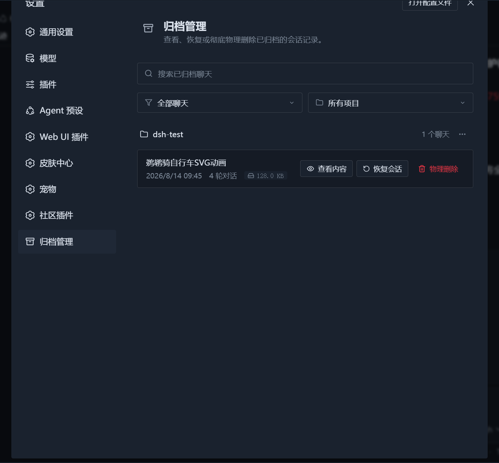

# DSH Archive Manager · Codex-style Archived Session Management

[中文](README.md) | English

[](https://www.npmjs.com/package/@mlgbnb/dsh-archive-manager)
[](https://www.npmjs.com/package/@mlgbnb/dsh-archive-manager)



**DSH Archive Manager** is a DeepSeek Harness (DSH) Web UI plugin that adds a Codex-style archived session manager to the settings page. It lets you view, search, filter, **preview conversation history**, restore, and permanently delete archived sessions, with live synchronization to the sidebar.

The current release requires DSH `>=0.1.2-alpha.2` and supports the `DSH_HOME` environment variable for selecting the DSH data directory.

## Features

- **Codex 1:1 look and interaction**
  - The card follows the DSH official card style (dark background, 12px rounded corners, rotating chevron), loaded under **Settings -> Plugins**.
  - Includes a top search bar (`Search archived chats`), sort/filter controls (`All chats` / `Earliest first`), and project filters (`All projects` / individual projects).
- **Group by project with batch management**
  - Sessions are grouped by workspace/project automatically, with folder icons and conversation counts.
  - Each project group has a `···` menu with one-click **delete all contents in this project**.
- **Real content parsing, preview and restore**
  - Parses the underlying session stream to show accurate titles, creation time, turn count and disk size, with Codex-style dates (e.g. `August 15, 2026, 1:34`).
  - **Conversation preview**: click **View** to browse the latest 50 user/assistant messages in a modal (system-injected text is stripped automatically) — no need to restore first.
  - **Unarchive**: restores a session back to its original workspace list immediately, with SSE real-time sidebar sync.
  - **Permanent delete**: removes the session metadata and disk data files to free storage.
- **Zero-dependency decompression engine**
  - Built-in zstd multi-frame decompressor based on Node `zlib`; reads both `session.jsonl.zstd` and plain `session.jsonl` — no external `zstd` CLI required.
- **Live two-way sync**
  - When the card is open, it listens for sidebar archive changes and updates the archive list automatically when sessions are archived or restored.

## Installation

DSH uses the Cordis modular microkernel architecture. You can install the plugin in either of the following ways.

### Requirements

- DSH `>=0.1.2-alpha.2`
- The Web Profile
- Node.js built-in `zlib` (no external `zstd` CLI is required)

### Option 1: Install from npm (recommended)

#### 1. Use the DSH CLI

```bash
dsh plugin --profile web add -w @mlgbnb/dsh-archive-manager
```

To pin the current release:

```bash
dsh plugin --profile web add -w "@mlgbnb/dsh-archive-manager@1.0.10"
```

#### 2. Or install it in the web profile directory

```bash
# When DSH_HOME is set
cd "$DSH_HOME/profiles/web"
# When DSH_HOME is unset
cd ~/.dsh/profiles/web
npm i @mlgbnb/dsh-archive-manager
# or with pnpm
pnpm add -w @mlgbnb/dsh-archive-manager
```

After installation, make sure `$DSH_HOME/profiles/web/package.json` (`~/.dsh/profiles/web/package.json` when `DSH_HOME` is unset) contains `@mlgbnb/dsh-archive-manager` in its `dsh.profile.bundles` array:

```json
{
  "name": "dsh-profile-web",
  "private": true,
  "dependencies": {
    "@mlgbnb/dsh-archive-manager": "^1.0.10"
  },
  "dsh": {
    "profile": {
      "bundles": [
        "@deepseek-ai/dsh-base",
        "@deepseek-ai/dsh-web-app",
        "@mlgbnb/dsh-archive-manager"
      ]
    }
  }
}
```

### Option 2: Install from a local source directory (link)

```bash
dsh plugin --profile web add -w "link:/path/to/dsh/plugin/dsh-archive-manager"
```

> If startup reports duplicate sub-package declarations after `add`, check the `dsh.profile.bundles` array in `$DSH_HOME/profiles/web/package.json` (`~/.dsh/profiles/web/package.json` when `DSH_HOME` is unset) to ensure it only contains root packages (such as `@mlgbnb/dsh-archive-manager`, `@linxin666/dsh-web-ui-all`, etc.).

## Usage

Start the DSH web service:

```bash
dsh --profile web
# or
dsh web
```

Open [http://127.0.0.1:3080/](http://127.0.0.1:3080/), click the gear icon at the bottom of the sidebar, and enter **Settings -> Plugins**. The "Archive Manager" card will appear there.

## Project Structure

```text
dsh-archive-manager/
├── cordis.patch.yml   # Cordis plugin profile declaration patch
├── package.json       # Package manifest and dependency declarations
├── README.md          # Chinese documentation
├── README.en.md       # English documentation
├── docs/
│   └── images/        # Screenshots and preview images
├── lib/
│   ├── index.js       # Host (provides /api/dsh-archive-manager/* routes and workspaceRegistry interaction)
│   └── client.js      # Client (Codex-style card interaction, project grouping, search/filter, preview modal, delete and restore logic)
└── src/
    └── index.ts       # TypeScript companion source (type declarations and host entry notes)
```

At runtime, the plugin reads `storages/workspace.json`, `storages/session_projcache.json`, and the `sessions/` directory under the DSH data root. The root is resolved using DSH's `DSH_HOME` rules and defaults to `~/.dsh`.

## License

MIT
